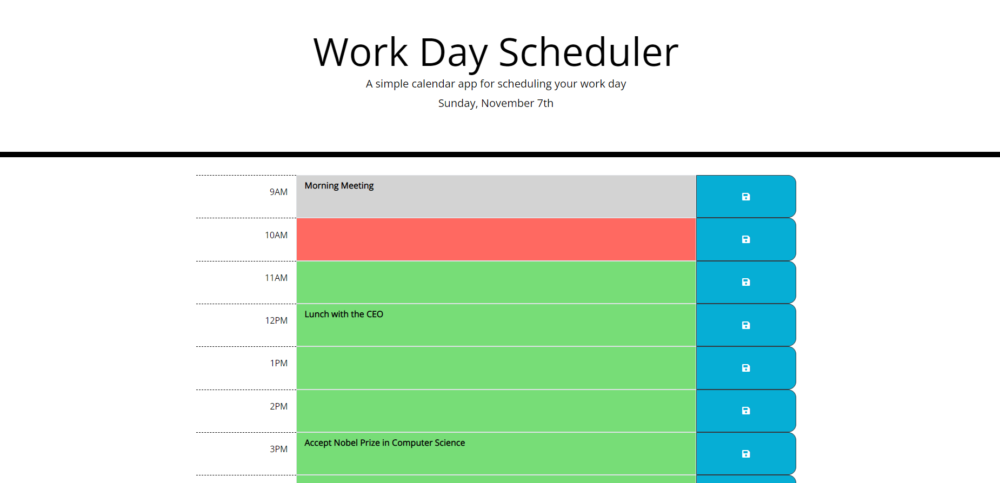

# Work_Day_Scheduler

## Purpose
A website that allows the user to schedule events for each hour of the day.  It will dynamically update the events and color code them realtive to when they are due.  Red means that the item is due right now.  Green means it is in the future, and grey means it is in the past. 

## Built with
* HTML
* CSS
* Javascript
* Moment.js
* jQuery

## Demonstrates the following skills:

    * Working with an array of Objects.
    * Working with arrays.
    * Working with strings.
    * Working with complicated logic
    * Dynamically creating web elements.
    * Using localStorage to save tasks that are scheduled throughout the day.
    * Use of a timer to periodically call moment.js for the current time.
    

##  Relevent Websites
#### Live Website: 
https://tgtiburon.github.io/Work_Day_Scheduler/
#### Github Repository:
https://github.com/tgtiburon/Work_Day_Scheduler

##

Made by Tony Gendreau

